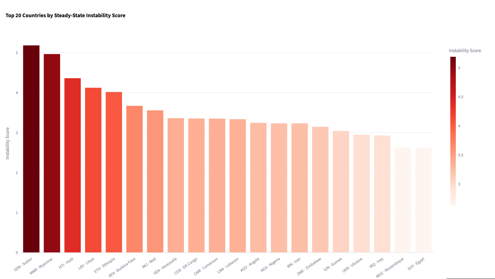
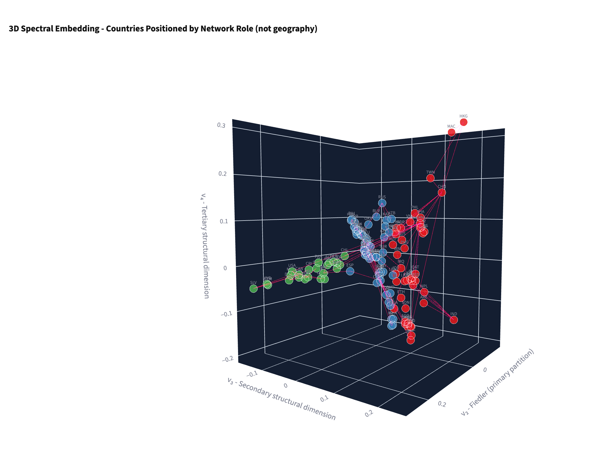

# Project Brief

### 1. Research Objective
**How do domestic fragilities and cross-border linkages interact to spread or contain global geopolitical instability?** Traditional models often treat countries in isolation; this project seeks to map the global system as an interconnected network to understand where shocks cascade and where they are absorbed.

### 2. Systemic Risk Measurement
The model produces a continuous measure of **Systemic Risk**, ranking 125 nations by their vulnerability to both internal deterioration and external contagion. It also maps **Instability Blocs** (groups of countries that share structural vulnerabilities and are tightly coupled enough to experience correlated crises).

### 3. Data Sources
The model is built on a 15-year panel data set encompassing 50 indicators for 125 countries. 
*   **Domestic Indicators:** Sourced from the IMF, World Bank, V-Dem, ACLED, and UCDP (covering political legitimacy, state capacity, economic performance, and security violence).
*   **Cross-Border Coupling:** Sourced from IMF DOTS (bilateral trade), UN DESA (migrant stocks), CEPII (geographic proximity), and COW (formal alliances).

### 4. Methodology
*   **Principal Component Analysis (PCA):** Used to reduce the 50 domestic indicators into a single, robust baseline instability score for each country.
*   **Spectral Graph Theory:** Applies eigenvalue decomposition, Fiedler vectors, and a modified Friedkin-Johnsen diffusion model to the country-coupling matrix to simulate how shocks propagate across borders. 

### 5. Top Limitations
1.  **Temporal Constraints:** The rigorous data requirements limit the panel to a 15-year window, which prevents backtesting against earlier crises like the 2008 Financial Crisis or the Arab Spring.
2.  **Coupling Bias:** The network linkages heavily weight physical and economic realities (trade, migration, borders) and may under-represent purely informational or cyber-driven contagion.

### 6. Interpretation and Findings
This model is designed as a **computational research prototype**. It is an empirical tool designed to test geopolitical scenarios (e.g., "What happens if a major hub experiences a sudden 3-standard-deviation shock?") rather than a deterministic forecast. 

Notably, cross-validation of the model revealed **The Empirical Limits of Contagion**: because the network coupling parameter is relatively low ($\alpha \approx 0.05$), the data proves that domestic structural inertia overwhelmingly dominates international spillovers. In short, the model demonstrates that massive shocks are more likely to be absorbed by neighbors than to trigger global cascading failures.
